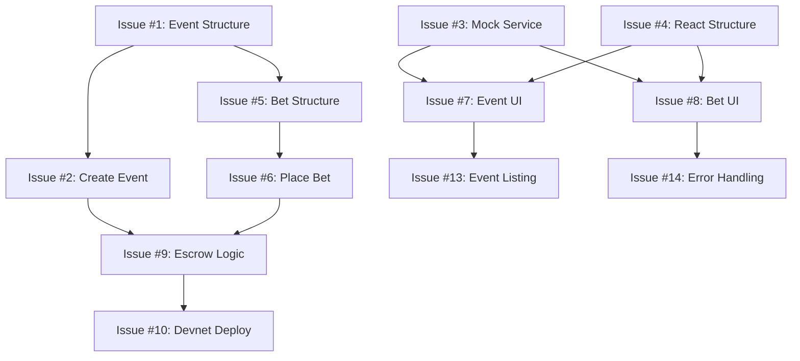

# Phase A GitHub Issues Tracking

## Overview
This document tracks all GitHub issues created for Phase A development (Weeks 1-3). Phase A focuses on **Solana programs + Anchor client** with the success criteria: "can create events and place bets on devnet".

## Issue Creation Status
❌ **GitHub MCP Authentication Failed** - Issues need to be created manually using the templates below.

## Critical Path Issues (Week 1)

### Issue #1: Define Event account structure and PDA design
**Priority:** Critical Path
**Stream:** Solana  
**Labels:** Phase A, Solana, Priority-1, Critical Path

**Description:** Define the core Event account structure that will serve as the foundation for all betting functionality. This PDA design is critical for the entire Solana program architecture.

**Template:**
```
## Phase A - Foundation: Critical Path Issue #1

### Description
Define the core Event account structure that will serve as the foundation for all betting functionality. This PDA (Program Derived Account) design is critical for the entire Solana program architecture.

### Acceptance Criteria
- [ ] Event struct defined with all required fields
- [ ] PDA seed derivation strategy implemented
- [ ] Account validation logic added
- [ ] Space calculation and rent exemption handled
- [ ] Admin-only creation constraints defined

### Technical Requirements
```rust
pub struct Event {
    pub admin: Pubkey,           // Event creator
    pub title: String,           // Event title (max 200 chars)
    pub description: String,     // Event description (max 500 chars) 
    pub option_a: String,        // Binary option A (max 100 chars)
    pub option_b: String,        // Binary option B (max 100 chars)
    pub deadline: i64,           // Betting deadline timestamp
    pub settlement_time: i64,    // When event concludes
    pub status: EventStatus,     // Active/Closed/Settled
    pub total_pool_a: u64,       // Total SOL bet on option A
    pub total_pool_b: u64,       // Total SOL bet on option B
    pub winner: Option<BetOption>, // Winning option (after settlement)
    pub created_at: i64,         // Creation timestamp
}
```

### Dependencies
None - This is the foundation issue

### Definition of Done
- Event struct compiles and tests pass
- PDA derivation works correctly
- Account initialization succeeds on devnet
- Documentation includes usage examples
```

---

### Issue #2: Implement create_event instruction
**Priority:** Critical Path
**Stream:** Solana
**Labels:** Phase A, Solana, Priority-1, Critical Path
**Dependencies:** Issue #1

**Template:**
```
## Phase A - Foundation: Critical Path Issue #2

### Description
Implement the create_event instruction that allows admins to create new betting events. This is the core admin functionality for the platform.

### Acceptance Criteria
- [ ] create_event instruction handler implemented
- [ ] Admin-only access control enforced
- [ ] Input validation for all event fields
- [ ] PDA creation and initialization
- [ ] Event status set to Active
- [ ] Comprehensive error handling

### Technical Requirements
- Validate admin signature
- Check event title/description length limits
- Ensure deadline is in the future
- Initialize Event PDA with provided data
- Emit event creation event (optional)
- Handle rent exemption properly

### Dependencies
- Issue #1: Event account structure must be defined

### Definition of Done
- Instruction compiles and tests pass
- Can create events on devnet
- Admin-only restriction works
- All validation edge cases covered
- Integration tests pass
```

---

### Issue #3: Build mock Solana service layer for frontend development
**Priority:** Critical Path
**Stream:** Frontend
**Labels:** Phase A, Frontend, Priority-1, Critical Path

**Template:**
```
## Phase A - Foundation: Critical Path Issue #3

### Description
Create a mock Solana service layer that enables frontend development in parallel with Solana program development. This allows the frontend team to make progress without waiting for real blockchain integration.

### Acceptance Criteria
- [ ] Mock wallet connection interface
- [ ] Mock event creation functionality
- [ ] Mock bet placement functionality
- [ ] Mock event listing and status
- [ ] Mock transaction confirmations
- [ ] Consistent API interface that matches future real implementation

### Technical Requirements
```typescript
interface MockSolanaService {
  // Wallet operations
  connectWallet(): Promise<{ publicKey: string }>;
  getBalance(): Promise<number>;
  
  // Event operations
  createEvent(event: EventInput): Promise<{ eventId: string }>;
  getEvents(): Promise<Event[]>;
  getEventById(id: string): Promise<Event>;
  
  // Betting operations
  placeBet(eventId: string, option: BetOption, amount: number): Promise<{ betId: string }>;
  getUserBets(userPubkey: string): Promise<Bet[]>;
  
  // Admin operations
  settleEvent(eventId: string, winner: BetOption): Promise<void>;
}
```

### Implementation Notes
- Store mock data in localStorage for persistence
- Generate realistic mock transaction IDs
- Simulate network delays (200-500ms)
- Include error scenarios for testing

### Dependencies
None - Enables parallel development

### Definition of Done
- Mock service implements all required methods
- Frontend can create and list events using mocks
- Mock data persists between sessions
- Ready to swap with real Solana integration
```

---

### Issue #4: Complete React TypeScript application structure
**Priority:** Critical Path
**Stream:** Frontend
**Labels:** Phase A, Frontend, Priority-1, Critical Path

**Template:**
```
## Phase A - Foundation: Critical Path Issue #4

### Description
Complete the React TypeScript application structure (continuation of Task 1.2). Establish the foundation for all frontend development with proper architecture, routing, and component organization.

### Acceptance Criteria
- [ ] Component architecture properly organized
- [ ] Routing setup for admin and user interfaces
- [ ] Context providers for state management
- [ ] TypeScript interfaces for all data types
- [ ] Basic styling system configured
- [ ] Development environment fully functional

### Technical Requirements
```
app/src/
├── components/
│   ├── common/          # Shared components
│   ├── admin/           # Admin-specific components
│   └── user/            # User-facing components
├── contexts/
│   ├── SolanaContext.tsx    # Solana service integration
│   └── BettingContext.tsx   # Betting state management
├── pages/
│   ├── AdminDashboard.tsx   # Admin event management
│   ├── EventList.tsx        # User event browsing
│   └── BetPlacement.tsx     # User betting interface
├── services/
│   └── solana.ts            # Solana service interface
├── types/
│   └── index.ts             # TypeScript type definitions
└── utils/
    └── helpers.ts           # Utility functions
```

### Dependencies
None - Foundation for all frontend work

### Definition of Done
- Application starts without errors
- Basic routing works between pages
- Mock service integration functional
- TypeScript compilation clean
- Ready for component development
```

## High Priority Issues (Week 2)

### Issue #5: Define Bet account structure and escrow logic
**Priority:** High
**Stream:** Solana
**Labels:** Phase A, Solana, Priority-2
**Dependencies:** Issue #1

### Issue #6: Implement place_bet instruction
**Priority:** High
**Stream:** Solana
**Labels:** Phase A, Solana, Priority-2
**Dependencies:** Issue #5

### Issue #7: Create basic event creation UI (admin interface)
**Priority:** High
**Stream:** Frontend
**Labels:** Phase A, Frontend, Priority-2
**Dependencies:** Issue #3, Issue #4

### Issue #8: Build bet placement UI components
**Priority:** High
**Stream:** Frontend
**Labels:** Phase A, Frontend, Priority-2
**Dependencies:** Issue #3, Issue #4

## Supporting Issues (Week 3)

### Issue #9: Implement basic escrow and settlement logic
**Priority:** Medium
**Stream:** Solana
**Labels:** Phase A, Solana, Priority-3

### Issue #10: Deploy programs to devnet
**Priority:** Medium
**Stream:** Solana
**Labels:** Phase A, Solana, Priority-3

### Issue #11: Set up Anchor client integration foundation
**Priority:** Medium
**Stream:** Integration
**Labels:** Phase A, Integration, Priority-3

### Issue #12: Create comprehensive program tests
**Priority:** Medium
**Stream:** Solana
**Labels:** Phase A, Solana, Priority-3

### Issue #13: Implement event listing and status display
**Priority:** Medium
**Stream:** Frontend
**Labels:** Phase A, Frontend, Priority-3

### Issue #14: Add basic error handling and loading states
**Priority:** Medium
**Stream:** Frontend
**Labels:** Phase A, Frontend, Priority-3

### Issue #15: Configure development environment for both streams
**Priority:** Low
**Stream:** Integration
**Labels:** Phase A, Integration, Priority-4

### Issue #16: Establish testing framework for integration
**Priority:** Low
**Stream:** Integration
**Labels:** Phase A, Integration, Priority-4

## Issue Dependencies



## Success Metrics for Phase A

**Week 3 Target:** "Can create events and place bets on devnet"

### Technical Validation
- [ ] Event creation works end-to-end on devnet
- [ ] Bet placement works with real SOL escrow
- [ ] Admin can create events via web interface
- [ ] Users can see events and place bets
- [ ] Mock frontend fully functional
- [ ] Ready for Phase B wallet integration

### Business Validation  
- [ ] Demo-ready for stakeholder review
- [ ] Non-technical users can create events
- [ ] Core betting flow is intuitive
- [ ] Performance acceptable for development
- [ ] Documentation supports Phase B development

## Manual Issue Creation Instructions

Since GitHub MCP authentication failed, please create these issues manually:

1. Go to: https://github.com/baronsengir007/Shin2chin/issues/new
2. Copy the template content for each issue
3. Add the specified labels
4. Create milestone "Phase A - Foundation" if it doesn't exist
5. Assign to the milestone
6. Update this document with actual issue numbers

## Assignment Recommendations

**Solana Developer:** Issues #1, #2, #5, #6, #9, #10, #12
**Frontend Developer:** Issues #3, #4, #7, #8, #13, #14  
**Both/Lead:** Issues #11, #15, #16 (integration and environment)

---

*Last Updated: January 29, 2025*
*Total Issues: 16*
*Critical Path: 4 issues*
*Phase A Target: Week 3 - "Can create events and place bets on devnet"*